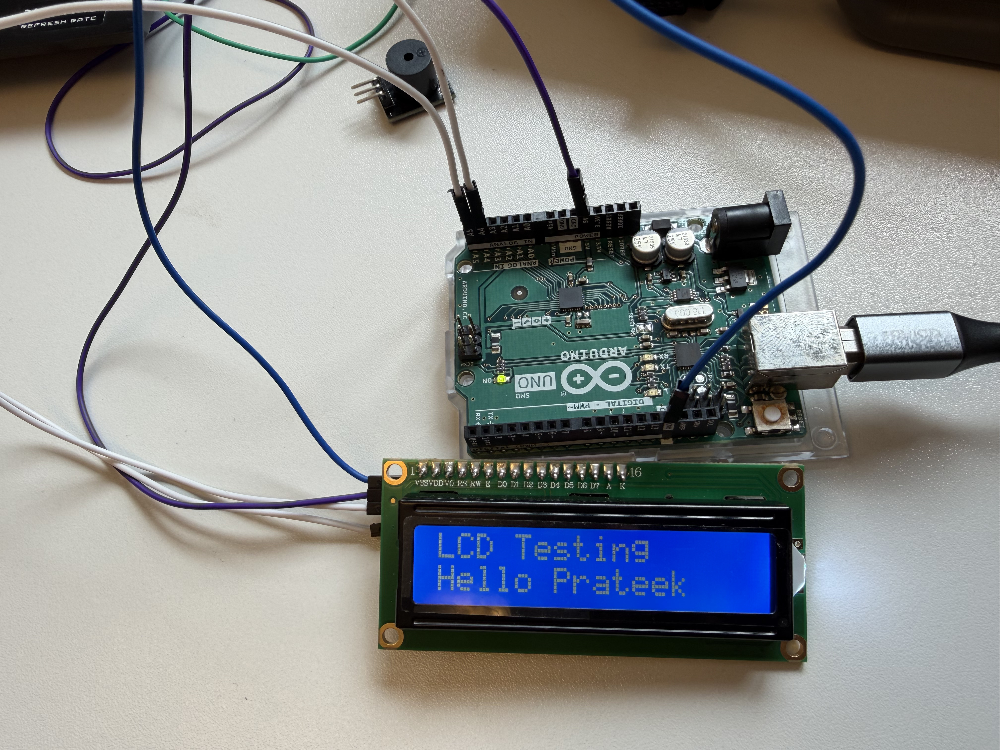
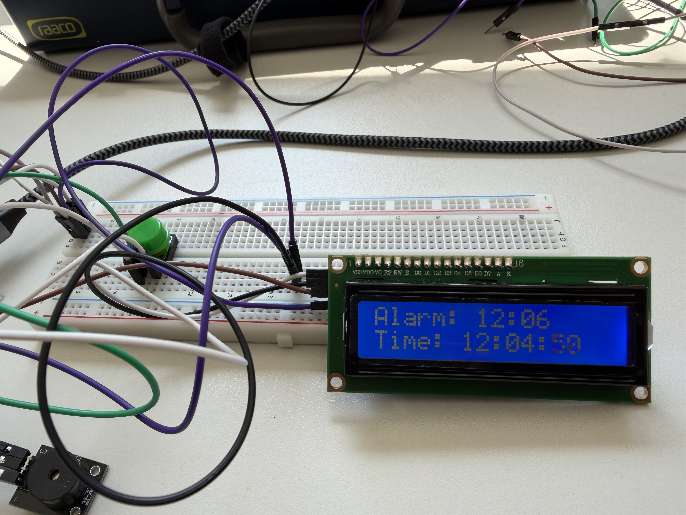

# 🚀 From Blinking to Thinking: Building an Intelligent Alarm Clock from Scratch

Welcome to my hardware engineering series! In this multi-part developer blog, I trace my journey of building a fully integrated, standalone smart alarm clock using an **Arduino Uno**.

Instead of just building a standard clock that lets you lazily slap a snooze button, I engineered a system that forces you to engage your brain: the alarm **will not shut up** until you manually log the correct answer to a randomized math puzzle.

Here is the step-by-step evolutionary process of how this system was built, sub-circuit by sub-circuit.

---

## 📝 Post 1: Making Some Noise with a Piezo Buzzer

Every great embedded project starts with a single peripheral. For my first sub-circuit, the goal was simple: get comfortable managing digital outputs and timing loops by interfacing a basic piezo buzzer.

### The Hardware Setup

The layout here is beautifully minimal. I routed **Digital Pin 12** from the Arduino Uno into a **220 $\Omega$ current-limiting resistor**, plugged that into the positive terminal of the piezo buzzer, and tied the negative lead straight back to Ground (`GND`).

### Down the Code Hole: `buzzer_test.ino`

The software relies on the foundational `digitalWrite()` and `delay()` functions. By pulsing the pin between `HIGH` (5V) and `LOW` (0V), we control exactly when the buzzer sings and when it rests.

```cpp
const int buzzerPin = 12; 

void setup() {
  pinMode(buzzerPin, OUTPUT);    // Configure our pin as an output channel
}

void loop() {
  digitalWrite(buzzerPin, HIGH); // Sound ON
  delay(1000);                   // Keep it on for 1 second (1000ms)
  
  digitalWrite(buzzerPin, LOW);  // Sound OFF
  delay(1000);                   // Silence for 1 second
}

```

### Engineering Insights

* **The Rapid Chirp:** Dropping both delays down to `100ms` turned a lazy, rhythmic beep into a frantic, high-tempo warning chirp.
* **The Symmetrical Trap:** Embedded programming taught me quickly that human perception relies entirely on state *transitions*. If you remove the `LOW` phase delay, the code loops back to `HIGH` instantly. To your ears, the buzzer just screams continuously because the microcontroller is cycling faster than the physical ceramic element can reset.

### The Circuit says "Cheese"

<video src= "https://github.com/user-attachments/assets/30e43e1f-82c9-4d9e-9ad2-2966eb6e4e25" controls autoplay muted loop style="max-width: 100%;"> </video>

---

## 📝 Post 2: Taming the $I^2C$ Liquid Crystal Display (LCD)

A system that can only communicate in raw beeps isn't a great user experience. Next, I needed a visual UI. I brought in a standard $2 \times 16$ character LCD display. However, instead of wiring it up using a messy, parallel layout that devours 10 to 12 precious digital pins, I opted for an **$I^2C$ backpack interface**.

### The Magic of $I^2C$

The $I^2C$ (Inter-Integrated Circuit) protocol is an absolute lifesaver for pin-constrained microcontrollers. It allows multiple master and slave components to share a communication bus using just **two signal wires**:

1. **SDA (Serial Data):** The bidirectional line that carries the actual data packets.
2. **SCL (Serial Clock):** The clock line generated by the Arduino to keep the data bits perfectly synchronized.

By sharing these lines alongside standard 5V and GND power, I successfully cut my wiring footprint down to just **4 wires total**.

### Hunting for Hex Addresses

Before printing pixels, I had to figure out the LCD's unique factory-set hardware memory address so the Arduino knew exactly where to point its data packets. I flashed an `I2C_scanner.ino` utility sketch which pinged the bus and immediately reported back the device's hexadecimal identifier: **`0x27`**.

With the address secured, getting a custom greeting on the screen was incredibly straightforward:

```cpp
#include <Wire.h> 
#include <LiquidCrystal_I2C.h>

LiquidCrystal_I2C lcd(0x27, 16, 2); // Address 0x27, 16 columns, 2 rows

void setup() {
  lcd.init();                      
  lcd.backlight();                  // Turn on the screen's LED backlight
  
  lcd.setCursor(0, 0);              // Start typing at top-left corner (col 0, row 0)
  lcd.print("Hello! Prateek");      
}

void loop() {}

```

### Engineering Insights

* **The Blank Screen Panic:** When I first powered it on, the screen lit up but showed generic solid white blocks. A quick turn of the tiny contrast potentiometer on the back of the $I^2C$ backpack instantly brought my text out of the shadows.

### The Circuit says "Cheese"

<div align="center">

|   | 
| :---: |

</div>

---

## 📝 Post 3: Adding a Real-Time Clock (RTC) to the Shared Bus

An alarm clock needs to keep flawless time, even if it gets completely unplugged from its primary USB power source. To handle this, I introduced a **Real-Time Clock (RTC) module** driven by an independent onboard coin-cell backup battery.

### Bus Sharing in Action

Because the RTC *also* communicates over the $I^2C$ protocol, I didn't need to hunt for open digital pins on the Arduino. Instead, I wired the RTC's SDA and SCL pins directly into the exact same breadboard rails as the LCD.

When I ran my trusty I2C scanner utility again, the terminal beautifully listed two active nodes simultaneously sharing the same wires:

* **`0x27`** — My LCD Screen.
* **`0x68`** — The newly added RTC Module (standard hardware address for DS1307/DS3231 chips).

### Engineering Insights

* **The Power-Cut Test:** I loaded up a live clock script, let it run, and then abruptly yanked the USB power cord out of the Arduino. I waited a few minutes, plugged it back in, and watched the LCD boot back up. The time didn't reset to midnight; it was perfectly accurate. The coin-cell battery successfully kept the internal crystal oscillator ticking in total darkness.

### The Circuit says "Cheese"

<video src= "https://github.com/user-attachments/assets/9c5eb069-d962-40c9-8ea6-d6f2f0511203" controls autoplay muted loop style="max-width: 100%;"> </video>

---

## 📝 Post 4: Interfacing the Humble Push Button

Inputs are inherently noisy, chaotic things. For my fourth sub-circuit, I introduced tactile push buttons to give users physical control over the system.

### Electrical Magic: `INPUT_PULLUP`

If you leave an input pin completely disconnected while a button isn't pushed, it picks up ambient electromagnetic static from the air. It enters a "floating state" and erratically bounces between 0 and 1. To fix this without cluttering my breadboard with external resistors, I utilized the Arduino's built-in internal pull-up resistor:

```cpp
pinMode(2, INPUT_PULLUP);

```

This forces the pin safely to a steady `HIGH` state (5V). Pressing the button bridges the line straight to Ground, causing it to drop to a clean `LOW` (0V). This means our code runs on **inverted logic**: `LOW` means pressed, `HIGH` means unpressed.

### Engineering Insights

* **The "Contact Bounce" Phenomenon:** Mechanical buttons don't make perfect electrical contact instantly. When you press one, the internal metal plates micro-vibrate, tricking a blazing-fast CPU into thinking you pressed the button 5 times in a millisecond. To combat this, I implemented a software-based debounce strategy to ignore these microsecond vibrations and provide a stable, clean state signal.

### The Circuit says "Cheese"

<video src= "https://github.com/user-attachments/assets/502bb606-7d94-4eb6-93e0-5c2cd1a934d1" controls autoplay muted loop style="max-width: 100%;"> </video>

<div align="center">

|   | 
| :---: |

</div>

<div align="center">

|   | 
| :---: |

</div>

<video src= "https://github.com/user-attachments/assets/f8d44b94-1ee6-478e-ae96-5a5b47757d6b" controls autoplay muted loop style="max-width: 100%;"> </video>

---

## 🏁 The Grand Finale: Constructing the Full Smart Math Alarm Clock

With all four sub-circuits validated, it was time for the ultimate system synthesis. I merged the inputs and outputs onto a single layout, upgrading the hardware interface to **three tactical push buttons** to allow a user to enter an active "Setting Mode", adjust time variables on the fly, and tackle a randomized mental math challenge to silence the alarm.

```
+-------------------------------------------------------------------+
|                        SMART ALARM CLOCK                          |
|                                                                   |
|  [I2C LCD Display] ---------+                                     |
|   (Shows Time / Math)       |                                     |
|                             v                                     |
|  [I2C RTC Module] -----> [SHARED] ---> [Arduino Uno]              |
|   (Tracks Real Time)     I2C BUS          |   |                   |
|                                           |   +-> [Piezo Buzzer]  |
|  [3x Push Buttons]                        |        (Audio Alarm)  |
|   (Mode, Up, Down) -----------------------+                       |
+-------------------------------------------------------------------+

```

### The State-Machine Architecture

To manage multiple buttons and modes without the code colliding with itself, the firmware relies on a structural programming concept called a **State Machine**. The system operates in three distinct states: `RUNNING_CLOCK`, `SET_ALARM`, and `ALARM_RINGING`.

```cpp
#include <Wire.h>
#include <LiquidCrystal_I2C.h>
#include <RTClib.h>

// Component Initializations
LiquidCrystal_I2C lcd(0x27, 16, 2);
RTC_DS1307 rtc;

// Hardware Pin Designations
const int buzzerPin = 12;
const int btnMode = 2;    // Mode switch / Submit Answer
const int btnUp = 3;      // Increment (+)
const int btnDown = 4;    // Decrement (-)

// System States
enum ClockState { RUNNING_CLOCK, SET_ALARM, ALARM_RINGING };
ClockState systemState = RUNNING_CLOCK;

// Configuration Variables
int alarmHour = 7;
int alarmMinute = 30;
int settingStep = 0; // 0 = Hour setting, 1 = Minute setting

// Math Challenge Variables
int num1, num2, correctSolution;
int userAnswer = 0;

void generateMathProblem() {
  randomSeed(analogRead(A0)); // Seed with floating analog white noise on unused pin
  num1 = random(6, 19);
  num2 = random(6, 19);
  correctSolution = num1 + num2;
  userAnswer = 0; 
}

void setup() {
  pinMode(buzzerPin, OUTPUT);
  pinMode(btnMode, INPUT_PULLUP);
  pinMode(btnUp, INPUT_PULLUP);
  pinMode(btnDown, INPUT_PULLUP);
  
  lcd.init();
  lcd.backlight();
  rtc.begin();
}

void loop() {
  DateTime now = rtc.now();

  switch (systemState) {
    
    // STATE 1: REGULAR CLOCK OPERATION
    case RUNNING_CLOCK:
      lcd.setCursor(0, 0);
      lcd.print("TIME: " + now.timestamp(DateTime::TIMESTAMP_TIME));
      lcd.setCursor(0, 1);
      lcd.print("ALARM: " + String(alarmHour) + ":" + (alarmMinute < 10 ? "0" : "") + String(alarmMinute) + "   ");

      if (digitalRead(btnMode) == LOW) {
        delay(250); // Debounce
        systemState = SET_ALARM;
        settingStep = 0; 
        lcd.clear();
      }

      if (now.hour() == alarmHour && now.minute() == alarmMinute && now.second() == 0) {
        systemState = ALARM_RINGING;
        generateMathProblem();
        lcd.clear();
      }
      break;

    // STATE 2: ALARM SETTING INTERFACE
    case SET_ALARM:
      lcd.setCursor(0, 0);
      lcd.print("SET ALARM MODE ");
      
      if (settingStep == 0) {
        lcd.setCursor(0, 1);
        lcd.print("> Hour: " + String(alarmHour) + "      ");
        if (digitalRead(btnUp) == LOW) { delay(200); alarmHour = (alarmHour + 1) % 24; }
        if (digitalRead(btnDown) == LOW) { delay(200); alarmHour = (alarmHour == 0) ? 23 : alarmHour - 1; }
      } else {
        lcd.setCursor(0, 1);
        lcd.print("> Minute: " + String(alarmMinute) + "    ");
        if (digitalRead(btnUp) == LOW) { delay(200); alarmMinute = (alarmMinute + 1) % 60; }
        if (digitalRead(btnDown) == LOW) { delay(200); alarmMinute = (alarmMinute == 0) ? 59 : alarmMinute - 1; }
      }

      if (digitalRead(btnMode) == LOW) {
        delay(250);
        if (settingStep == 0) {
          settingStep = 1; 
        } else {
          systemState = RUNNING_CLOCK; 
          lcd.clear();
          lcd.print("Alarm Saved!");
          delay(1000);
          lcd.clear();
        }
      }
      break;

    // STATE 3: THE COGNITIVE DISARM ALARM
    case ALARM_RINGING:
      digitalWrite(buzzerPin, (now.second() % 2 == 0) ? HIGH : LOW); // Toggle beep sound pattern

      lcd.setCursor(0, 0);
      lcd.print("SOLVE TO SILENCE");
      lcd.setCursor(0, 1);
      lcd.print(String(num1) + " + " + String(num2) + " = " + String(userAnswer) + "   ");

      if (digitalRead(btnUp) == LOW) { delay(150); userAnswer++; }
      if (digitalRead(btnDown) == LOW) { delay(150); userAnswer--; }

      if (digitalRead(btnMode) == LOW) {
        delay(250);
        if (userAnswer == correctSolution) {
          digitalWrite(buzzerPin, LOW);
          systemState = RUNNING_CLOCK;
          lcd.clear();
          lcd.print("Correct! Morning!");
          delay(2000);
          lcd.clear();
        } else {
          lcd.setCursor(0, 0);
          lcd.print("Wrong! Try Again");
          delay(1000);
        }
      }
      break;
  }
}

```

### Key Engineering Insights from the Final Integration

* **Optimizing CPU Cycles:** Initially, printing the current time constantly over the $I^2C$ bus while driving the buzzer caused stuttering audio. By isolating the LCD print commands inside a structural state architecture (`switch(systemState)`), I freed up execution cycles right when the microcontroller needed them most.
* **True Randomization:** Computers are notoriously bad at being truly random. If you don't seed them correctly, they generate the exact same puzzle sequences every time they boot up. I fixed this by reading floating, analog white noise from an unconnected analog pin (`analogRead(A0)`) to seed the algorithm, ensuring a fresh mental challenge every morning.
* **Control UI Scale:** Adding dedicated Up and Down navigation channels completely eliminated menu bottlenecks. Instead of a user awkwardly looping variables forward if they missed their target digit, the dedicated decremental tracking wire allows instant localized adjustments.

### The Circuit says "Cheese"

<video src= "https://github.com/user-attachments/assets/b9994a65-a222-4d7a-a64f-eeebd8a0c985" controls autoplay muted loop style="max-width: 100%;"> </video>

<video src= "https://github.com/user-attachments/assets/b6e08d07-1c67-4d2c-bfb2-a1d03c58fc97" controls autoplay muted loop style="max-width: 100%;"> </video>

---

## Wrap-Up

What started as a simple, single-component exercise evolved into a highly responsive, multi-protocol embedded system. This project highlighted how elegant code design can bridge hardware limitations—saving I/O pins via shared communication buses, cleaning up mechanical noise through software debouncing, and building a state machine that handles complex user experiences.

---

<br>

[← Back to Table of Contents](../README.md)
