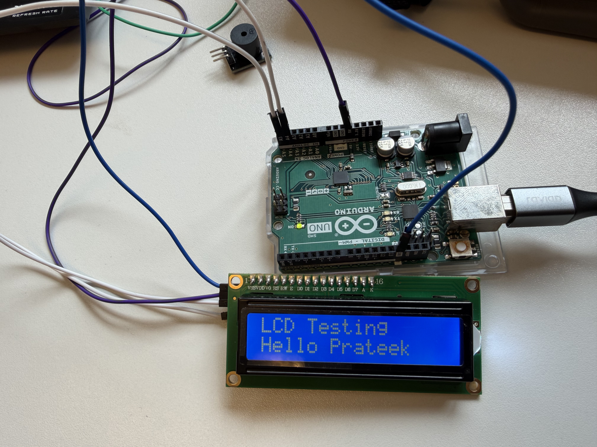
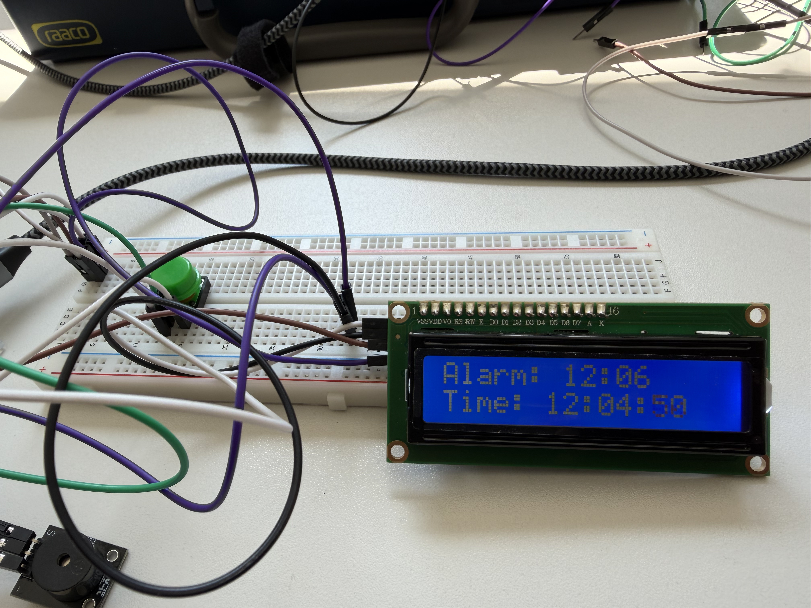

# Introduction to Arduino: Build a custom Alarm Clock

In the exercise 2, we had to complete four sub-circuits to achieve the final objective of building a custom Alarm Clock.
* **Sub-circuit 1:** Connecting the buzzer
* **Sub-circuit 2:** Connecting the LCD screen
* **Sub-circuit 3:** Expanding the setup with a Real Time Clock
* **Sub-circuit 4:** Using the Push Buttons

---

### Sub-circuit 1: Connecting the buzzer

For our first sub-circuit, the goal was to manage digital output and timing loop by connecting a basic piezo buzzer.

---

#### The Hardware Setup

We routed the Digital Pin 12 from the Arduino Uno into a 220 $\Omega$ resistor, plugged that into the positive terminal of the piezo buzzer, and tied the negative lead back to Ground (GND).

---

#### Buzzer Test Code: buzzer_test.ino

The software depends on the `digitalWrite()` and `delay()` functions. By alternating the pin between `HIGH` (5V) and `LOW` (0V), we can control when the buzzer beeps and when it stays silent.

```cpp
const int buzzerPin = 12; 

void setup() {
  pinMode(buzzerPin, OUTPUT);    // Configure our pin as an output channel
}

void loop() {
  digitalWrite(buzzerPin, HIGH); // Sound ON
  delay(1000);                   // Keep it on for 1 second (1000ms)
  
  digitalWrite(buzzerPin, LOW);  // Sound OFF
  delay(1000);                   // Silence for 1 second
}

```

---

#### Observations

* **Rapid Beeping:** When we dropped delays for both `digitalWrite()` and `delay()` functions down to `100ms`, it modified a lazy, rhythmic beep into a frantic, high-tempo warning chirp.
* **The Symmetrical Trap:** When we removed the `LOW` phase delay, the code loops back to `HIGH` instantly. To our ears, the buzzer seems to be beeping continuously because the microcontroller is cycling faster than we can perceive.

<video src= "https://github.com/user-attachments/assets/30e43e1f-82c9-4d9e-9ad2-2966eb6e4e25" controls autoplay muted loop style="max-width: 100%;"> </video>

---

### Sub-circuit 2: Connecting the LCD screen

For our second sub-circuit, we needed to integrate visual UI by connecting a LCD screen. We were provided a standard `2x16` character LCD display. However, instead of wiring it up using parallel layout that exhausts 10 to 12 digital pins, we used **I2C protocol**.

---

#### Code to Find LCD's Hexadecimal Addresss: I2C_scanner.ino

Before we could printing something on the LCS screen, we had to find the LCD's unique factory-set hardware memory address in order for the Arduino to know exactly where to send the data packets. On the serial port output, the code returned the device's hexadecimal identifier: **`0x27`**.

---

#### Code to Print Text on LCD Screen: LCD_test.ino.

Once we found the address for the LCD screen, we could reference address in the code block to print a custom greeting message.

```cpp
#include <Wire.h> 
#include <LiquidCrystal_I2C.h>

LiquidCrystal_I2C lcd(0x27, 16, 2); // Address 0x27, 16 columns, 2 rows

void setup() {
  lcd.init();                      
  lcd.backlight();                  // Turn on the screen's LED backlight
  
  lcd.setCursor(0, 0);              // Start typing at top-left corner (col 0, row 0)
  lcd.print("Hello! Prateek");      
}

void loop() {}

```

---

#### Observations

* **Blank Screen:** When first powered, the screen lit up but showed default solid white blocks. We tuned the contrast potentiometer on the back of the I2C backpack and our text begin to emerge.
* **Uncomplicated Wiring:** I2C protocol allows multiple master and slave components to share a communication bus using just **two signal wires** thus simplifying the wiring.

<div align="center">

|   | 
| :---: |

</div>

---

### Sub-circuit 3: Expanding the setup with a Real Time Clock

For our third sub-circuit, we needed to integrate a **Real-Time Clock (RTC) module** driven by an independent onboard coin-cell backup battery.

Since RTC also communicates over the I2C protocol, we didn't need to find open digital pins on the Arduino. Instead, we wired the RTC's SDA and SCL pins directly into the same breadboard rails as the LCD.

---

#### Code to Find RTC's Hexadecimal Addresss: I2C_scanner.ino

Arduino needed the hexadecimal address for the RTC as well. We ran the I2C scanner utility again, and the serial port listed two active nodes simultaneously sharing the same wires:

* **`0x27`** — LCD Screen.
* **`0x68`** — The newly added RTC Module.

---

#### Observations
* **Testing RTC Power Backup:** We loaded a live clock script, let it run, and then abruptly removed the USB power cord out of the Arduino. As a result of the power-cut, the LCD turned off. After a few minutes, we plugged the power back on, as soon as the LCD booted up again, the time didn't reset and it dispalyed the correct time. The coin-cell battery successfully kept the RTC running.

<video src= "https://github.com/user-attachments/assets/9c5eb069-d962-40c9-8ea6-d6f2f0511203" controls autoplay muted loop style="max-width: 100%;"> </video>

---

### Sub-circuit 4: Using the Push Buttons

For our fourth sub-circuit, we introduced tactile push buttons to allow users to configure the system physically.

We used the Arduino's built-in internal resistor.

```cpp
pinMode(2, INPUT_PULLUP);

```

This forces the pin safely to a steady `HIGH` state (5V). Pressing the button bridges the line straight to Ground, causing it to drop to a clean `LOW` (0V). This means our code runs on **inverted logic**: `LOW` means pressed, `HIGH` means unpressed.

---

#### Observations
* **"Contact Bounce" Phenomenon:** Mechanical buttons don't make perfect electrical contact instantly. When we click a button, the internal metal plates micro-vibrate, making it appear to the microcontroller as if the button is clicked multiple times in a millisecond. To solve this, we had to implemented software-based debounce strategy to ignore these microsecond vibrations and provide a stable, clean state signal.

<video src= "https://github.com/user-attachments/assets/502bb606-7d94-4eb6-93e0-5c2cd1a934d1" controls autoplay muted loop style="max-width: 100%;"> </video>

<div align="center">

|   | 
| :---: |

</div>

<div align="center">

|   | 
| :---: |

</div>

<video src= "https://github.com/user-attachments/assets/f8d44b94-1ee6-478e-ae96-5a5b47757d6b" controls autoplay muted loop style="max-width: 100%;"> </video>

---

### Final Objective: Building a custom Alarm Clock

After assembling and validating all four sub-circuits, we were now left with building an Alarm Clock. We merged the inputs and outputs onto a single layout, upgrading the hardware interface to three tactical push buttons, each with a distinct function:
* **Button 1:** Enter "Settings Mode".
* **Button 2:** Set an Alarm.
* **Button 3:** Solve a random math challenge to silence the alarm.

```
+-------------------------------------------------------------------+
|                        SMART ALARM CLOCK                          |
|                                                                   |
|  [I2C LCD Display] ---------+                                     |
|   (Shows Time / Math)       |                                     |
|                             v                                     |
|  [I2C RTC Module] -----> [SHARED] ---> [Arduino Uno]              |
|   (Tracks Real Time)     I2C BUS          |   |                   |
|                                           |   +-> [Piezo Buzzer]  |
|  [3x Push Buttons]                        |        (Audio Alarm)  |
|   (Mode, Up, Down) -----------------------+                       |
+-------------------------------------------------------------------+

```

---

#### Code for Alarm clock with a Random Math Problem to Deactivate Alarm

To manage multiple buttons and modes without the code colliding with itself, the firmware relies on a structural programming concept called a **State Machine**. The system operates in three distinct states: `RUNNING_CLOCK`, `SET_ALARM`, and `ALARM_RINGING`.

```cpp
#include <Wire.h>
#include <LiquidCrystal_I2C.h>
#include <RTClib.h>

// Component Initializations
LiquidCrystal_I2C lcd(0x27, 16, 2);
RTC_DS1307 rtc;

// Hardware Pin Designations
const int buzzerPin = 12;
const int btnMode = 2;    // Mode switch / Submit Answer
const int btnUp = 3;      // Increment (+)
const int btnDown = 4;    // Decrement (-)

// System States
enum ClockState { RUNNING_CLOCK, SET_ALARM, ALARM_RINGING };
ClockState systemState = RUNNING_CLOCK;

// Configuration Variables
int alarmHour = 7;
int alarmMinute = 30;
int settingStep = 0; // 0 = Hour setting, 1 = Minute setting

// Math Challenge Variables
int num1, num2, correctSolution;
int userAnswer = 0;

void generateMathProblem() {
  randomSeed(analogRead(A0)); // Seed with floating analog white noise on unused pin
  num1 = random(6, 19);
  num2 = random(6, 19);
  correctSolution = num1 + num2;
  userAnswer = 0; 
}

void setup() {
  pinMode(buzzerPin, OUTPUT);
  pinMode(btnMode, INPUT_PULLUP);
  pinMode(btnUp, INPUT_PULLUP);
  pinMode(btnDown, INPUT_PULLUP);
  
  lcd.init();
  lcd.backlight();
  rtc.begin();
}

void loop() {
  DateTime now = rtc.now();

  switch (systemState) {
    
    // STATE 1: REGULAR CLOCK OPERATION
    case RUNNING_CLOCK:
      lcd.setCursor(0, 0);
      lcd.print("TIME: " + now.timestamp(DateTime::TIMESTAMP_TIME));
      lcd.setCursor(0, 1);
      lcd.print("ALARM: " + String(alarmHour) + ":" + (alarmMinute < 10 ? "0" : "") + String(alarmMinute) + "   ");

      if (digitalRead(btnMode) == LOW) {
        delay(250); // Debounce
        systemState = SET_ALARM;
        settingStep = 0; 
        lcd.clear();
      }

      if (now.hour() == alarmHour && now.minute() == alarmMinute && now.second() == 0) {
        systemState = ALARM_RINGING;
        generateMathProblem();
        lcd.clear();
      }
      break;

    // STATE 2: ALARM SETTING INTERFACE
    case SET_ALARM:
      lcd.setCursor(0, 0);
      lcd.print("SET ALARM MODE ");
      
      if (settingStep == 0) {
        lcd.setCursor(0, 1);
        lcd.print("> Hour: " + String(alarmHour) + "      ");
        if (digitalRead(btnUp) == LOW) { delay(200); alarmHour = (alarmHour + 1) % 24; }
        if (digitalRead(btnDown) == LOW) { delay(200); alarmHour = (alarmHour == 0) ? 23 : alarmHour - 1; }
      } else {
        lcd.setCursor(0, 1);
        lcd.print("> Minute: " + String(alarmMinute) + "    ");
        if (digitalRead(btnUp) == LOW) { delay(200); alarmMinute = (alarmMinute + 1) % 60; }
        if (digitalRead(btnDown) == LOW) { delay(200); alarmMinute = (alarmMinute == 0) ? 59 : alarmMinute - 1; }
      }

      if (digitalRead(btnMode) == LOW) {
        delay(250);
        if (settingStep == 0) {
          settingStep = 1; 
        } else {
          systemState = RUNNING_CLOCK; 
          lcd.clear();
          lcd.print("Alarm Saved!");
          delay(1000);
          lcd.clear();
        }
      }
      break;

    // STATE 3: THE COGNITIVE DISARM ALARM
    case ALARM_RINGING:
      digitalWrite(buzzerPin, (now.second() % 2 == 0) ? HIGH : LOW); // Toggle beep sound pattern

      lcd.setCursor(0, 0);
      lcd.print("SOLVE TO SILENCE");
      lcd.setCursor(0, 1);
      lcd.print(String(num1) + " + " + String(num2) + " = " + String(userAnswer) + "   ");

      if (digitalRead(btnUp) == LOW) { delay(150); userAnswer++; }
      if (digitalRead(btnDown) == LOW) { delay(150); userAnswer--; }

      if (digitalRead(btnMode) == LOW) {
        delay(250);
        if (userAnswer == correctSolution) {
          digitalWrite(buzzerPin, LOW);
          systemState = RUNNING_CLOCK;
          lcd.clear();
          lcd.print("Correct! Morning!");
          delay(2000);
          lcd.clear();
        } else {
          lcd.setCursor(0, 0);
          lcd.print("Wrong! Try Again");
          delay(1000);
        }
      }
      break;
  }
}

```

---

#### Observations
* **Randomizing Math Problem:** After a few test runs, the math problem appeared to be repeating. We fixed the randomization by reading floating, analog white noise from an unconnected analog pin `(analogRead(A0))` to seed the algorithm, ensuring a fresh math challenge every morning.
* **Control UI Scale:** We added dedicated Up and Down navigation feature for the buttons to enable user to make adjustments quickly instead of looping through alll the digits if they missed their target digit.

<video src= "https://github.com/user-attachments/assets/b9994a65-a222-4d7a-a64f-eeebd8a0c985" controls autoplay muted loop style="max-width: 100%;"> </video>

<video src= "https://github.com/user-attachments/assets/b6e08d07-1c67-4d2c-bfb2-a1d03c58fc97" controls autoplay muted loop style="max-width: 100%;"> </video>

---

<br>

[← Back to Table of Contents](../README.md)
