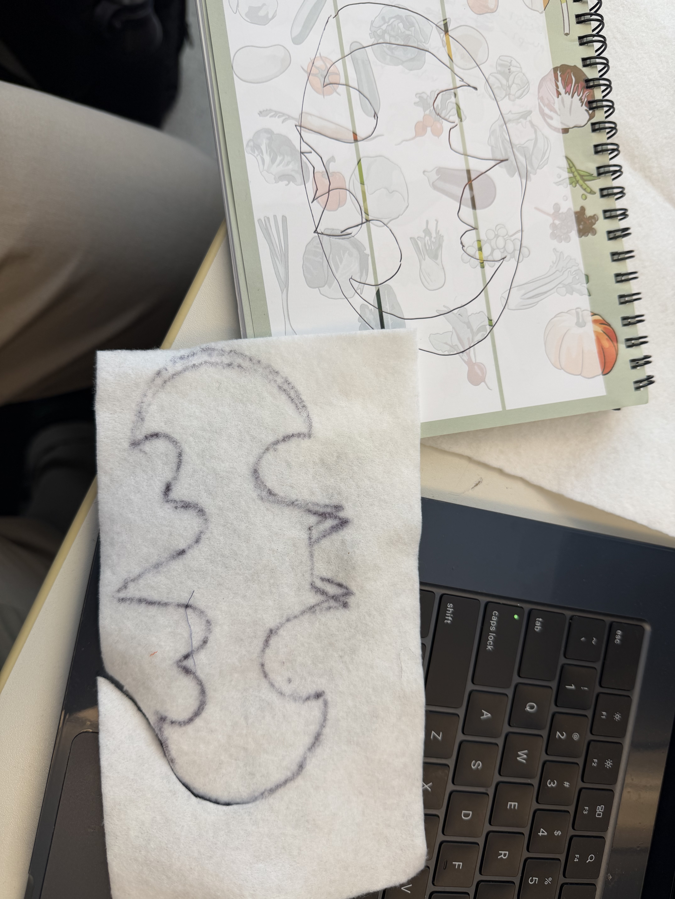
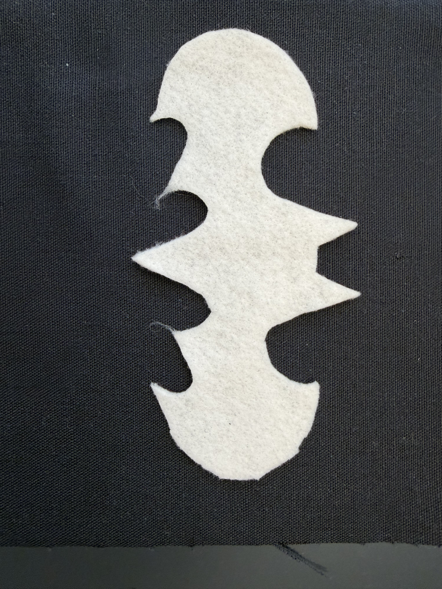
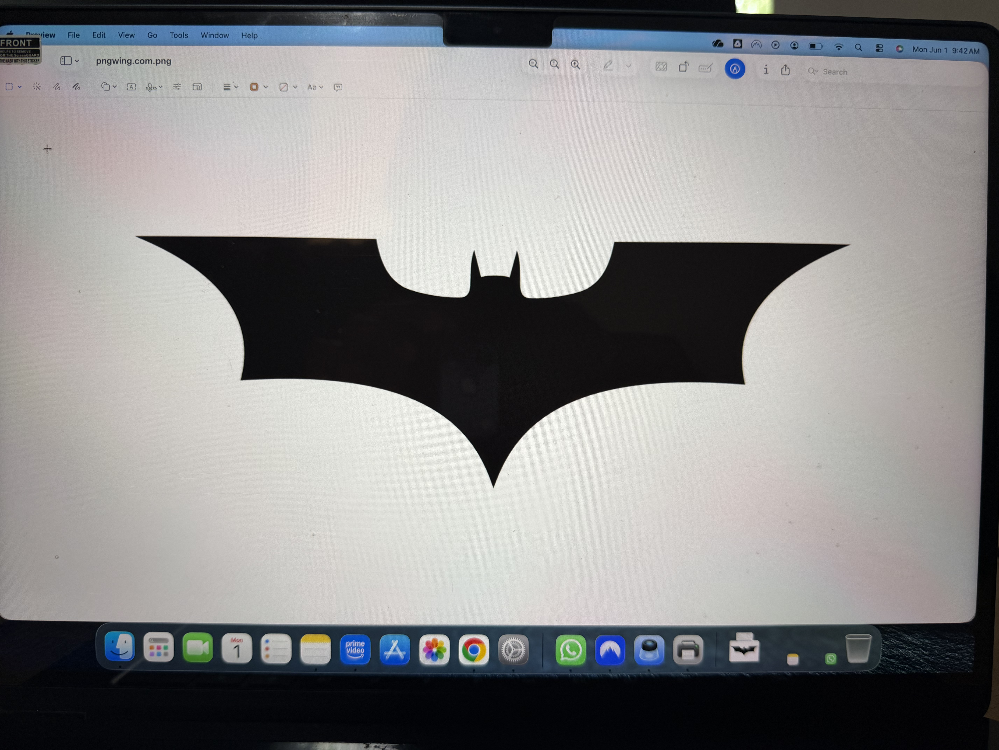
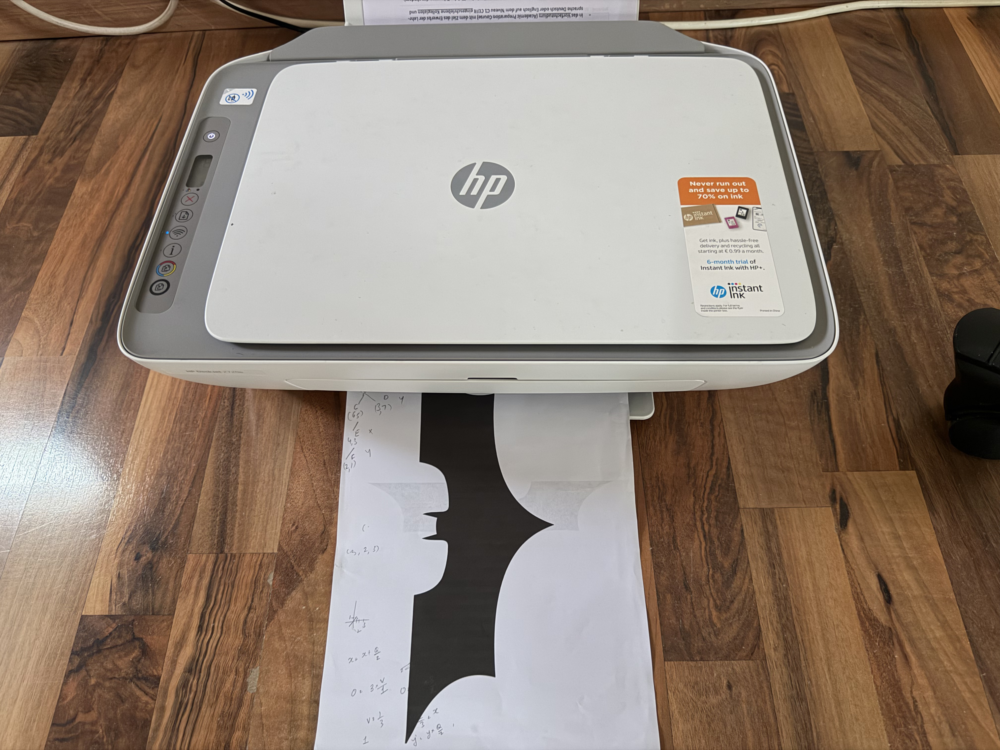
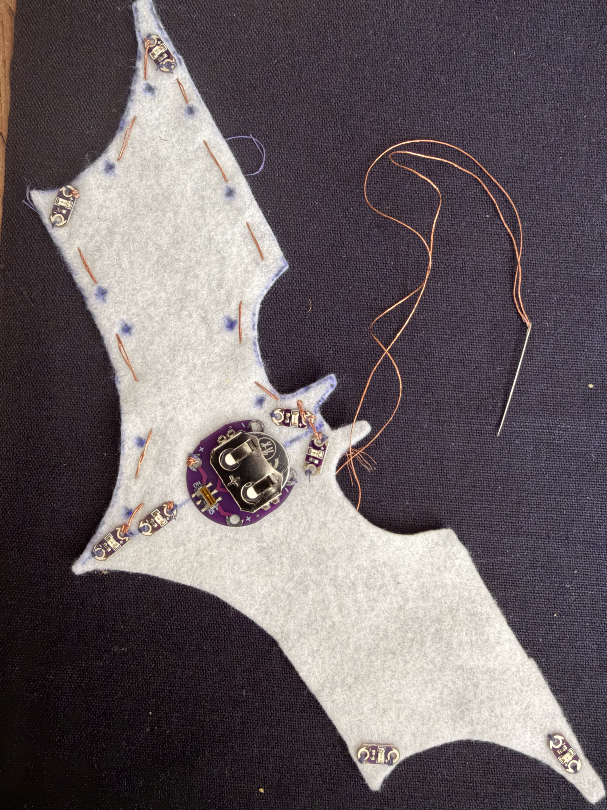
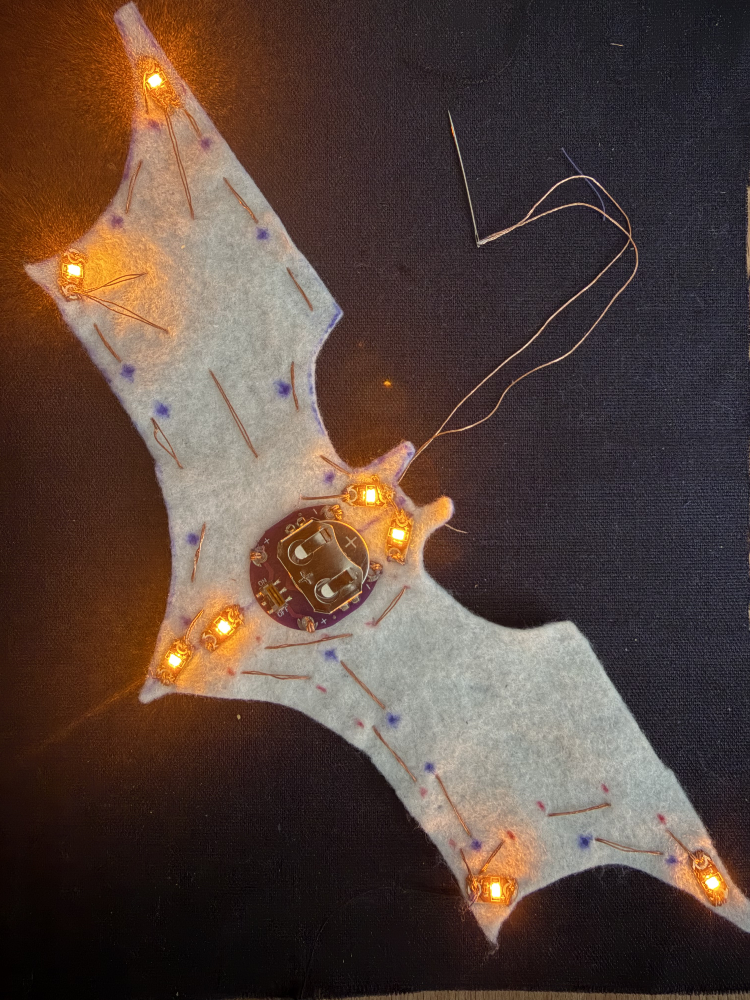
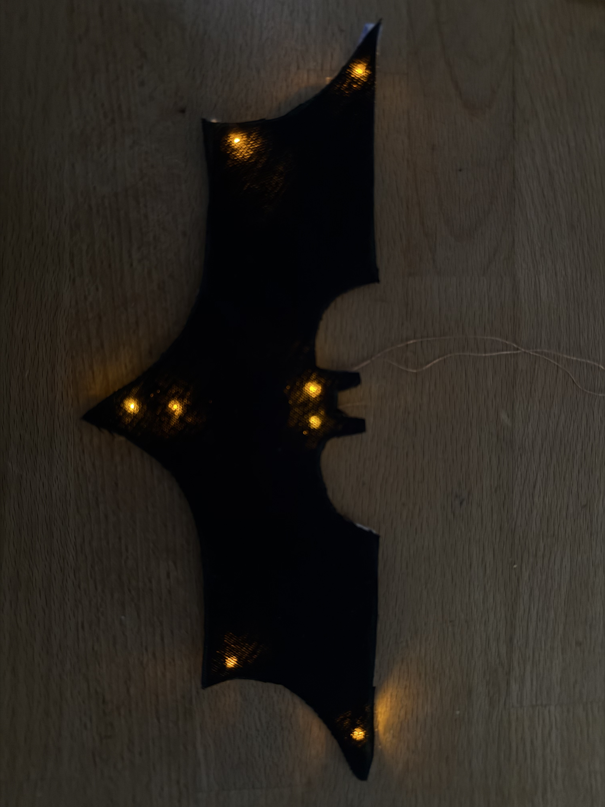

# E-Textiles
In the exercise 4, the class was tasked to construct a custom wearable e-textile patch packing minimum **5 LEDs** for a passing grade and **8 LEDs** for a good grade, powered by a coin-cell battery.

---

## Gear & Material Used

* A sewable 3V CR2032 coin-cell battery holder stitched directly to the textile.
* Raw, uninsulated conductive thread sewn entirely by hand.
* 8 LEDs wired in parallel.

---

## Attempt 1

I have been a Batman fanboy since childhood. So for my first attempt, I decided to design a Batman Logo, carefully sketching the geometric logo shape on paper first, and then using the paper as a stencil to cut the textile.

The textile-cutout looked great but I soon the flaws hidden in my design started screeching at me. Placing all 8 LEDs in parallel paths onto a surface with so many crevices and wedges, and very less uninterrupted space, meant sewing the uninsulated conductive wire in this cramped spapce which was bound to result in overlaps and thus  **short circuits** since this was also my first ever attempt at anything related to sewing!

I realised that I needed to modify my design to have wider uninterrupted spaces and fewer crevices and wedges. Only this way,  I will have enough space to sew the positive and negative terminals from all the LEDs and avoid them from overlapping.

|  The Batman Logo on Paper | Cutting out the Logo on Textlile  | 
| :---: | :---: |
|  |  |

---

## Attempt 2

I ripped out the old stitches to reuse the thread and LEDs, but the fanboy in me still haven't given up. I searched online for inspiration and found another Batman logo design that fit my requirements just right - straight lines, fewer wedges and more uninterrupted space.

| Searching for Inspiration | Printing the Updated Design  | 
| :---: | :---: |
|  |  |

Along with the new design, I also employed a two step strategy to place all LEDs and the battery back in place:

### 1. Spacing between LEDs

Before sewing them, I first placed all the LEDs at their intended places leaving ample distance between them to give the wiring enough breathing room and while also keeping their placement aesthetically pleasing.

### 2. Marking and color coding the conductive wire path 
Before I even picked up the needle to make a stitch, I grabbed two sketch pens to mark the wire paths:
* 🟦 **Blue Guidelines:** Marked the **positive ($+$) power rail** starting from the battery's positive terminal to the anodes of all 8 LEDs.
* 🟥 **Red Guidelines:** Marked the **negative (GND) return rail** starting from cathodes safely back to the battery's negative terminal.

This color coding worked as a schematic navigating my needle, allowing me to sew complex parallel paths without the challenge of overlapping wires which I encountered in my first attempt.

| Sewing the Conductive Thread | Marked Wire Paths  | 
| :---: | :---: |
|  |  |

---

## Final Product

In my second attempt, I succesfully fabricated the batman logo design with 8 LEDs while minimising the time spend at sewing, avoiding short circuits as well as loose connection knots at the terminals.

Things that helped me succeed by avoiding rework:
* **Parallel Connections vs Single Power Source:** In order for all 8 LEDs to have similar brightness intensity, it was essential to optimise the sewing path since the conductive thread acts as a high-resistance wire and all LEDs share single 3V coin-cell as power source.
* **Knot Securily:** Over the time, connection knots become loose at the terminals, so I used a nailpaint remover to seal the knots in place and avoid loose connections.
* **Marking the Path:** Color coding the wiring path before begining to sew helped me plan for possible wire overlaps and short circuits, which in the first attempt resulted in a lot of rework.

| Batman Logo Comes to Life 1 | Batman Logo Comes to Life 2  | 
| :---: | :---: |
|  | <video src= "https://github.com/user-attachments/assets/14035e09-d98e-4779-ade2-30842dd86f05" controls autoplay muted loop style="max-width: 100%;"> </video> |

---

 

[← Back to Table of Contents](../README.md)
