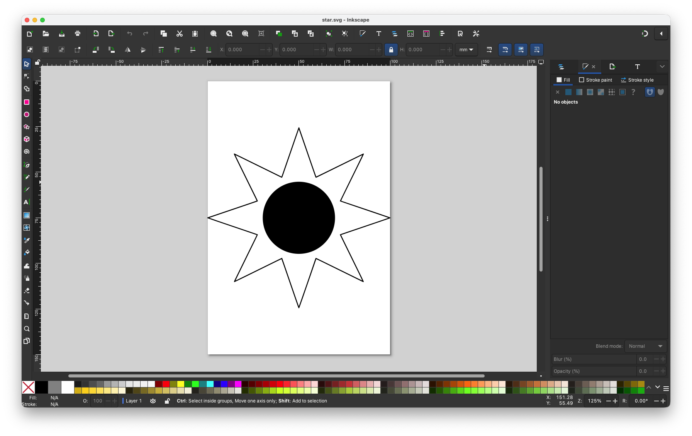
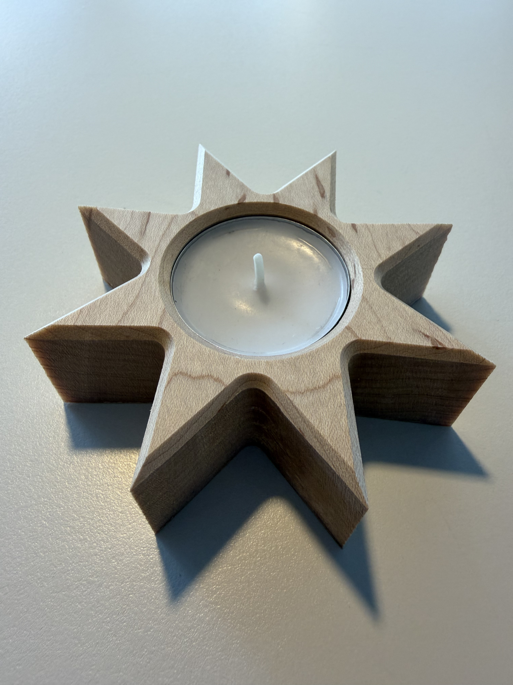
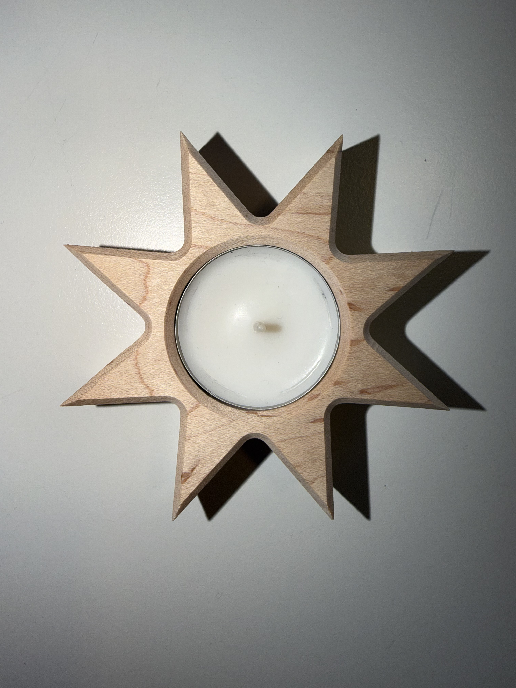

# CNC Milling

In the exercise 5,  students were tasked with designing a custom wooden tea light candle holder in Inkscape, and share the .svg file with the tutor to be milled.

Around the time of this exercise, there was a rare planetary alignment happening which inspired me to create an **8-point star** shaped design.

---

## The Inkscape Existential Crisis (Design Phase)

This was my first time using Inkscape and for the most part of time, I was just struggling to find my way around the tool.

My initial attempts at creating the design I decided resulted in some weird looking geometries. Eventually after spending roughly a day with the tool, I became confortable was able to complete my design meeting the lab's specifications:

* **The Stock Bounds:** Material canvas constraint of **100 × 150 mm**.
* **The Candle Pocket:** Circle centered and set to an exact diameter of **39.5 mm**

Once my design was ready, I exported the final **.svg file** and sent it over to the tutor for milling operation.

   

---

## Final Product

In the next module class, everyone was handed over their milled designs. Here is how my design turned out: 

| | |
| :---: | :---: | 
|  |  | 

 

The end-product mostly matched the design I created in Inkscape except for the sharp internal edges and angles. The outer 8 tips of my star came out perfectly aligned tot the design since the bit tracks cleanly along the outside, but the the inner edges of the star points did not have acute sharp angles but some radius equal to the radius of the milling bit.  The spinning, cylindrical milling bit **cannot** cut a perfectly sharp internal 90° or acute angles.

---

 

[← Back to Table of Contents](../README.md)
