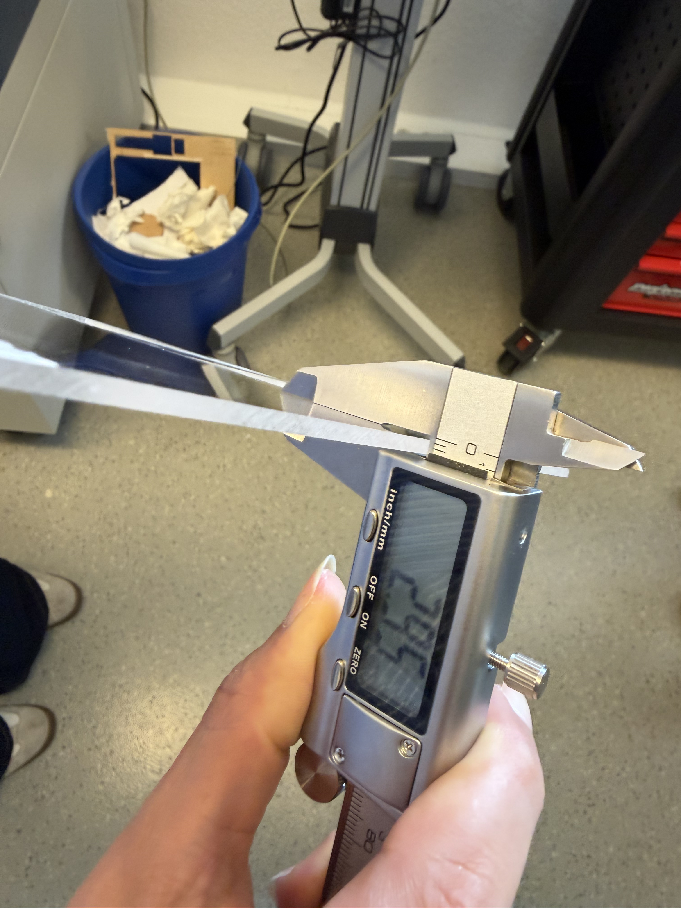
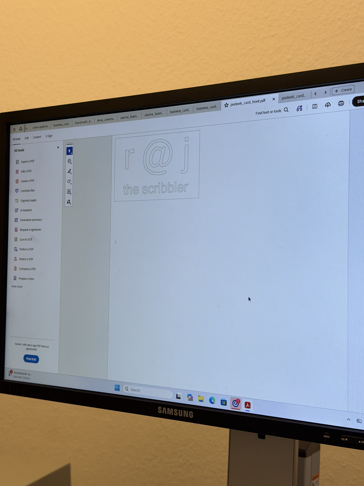
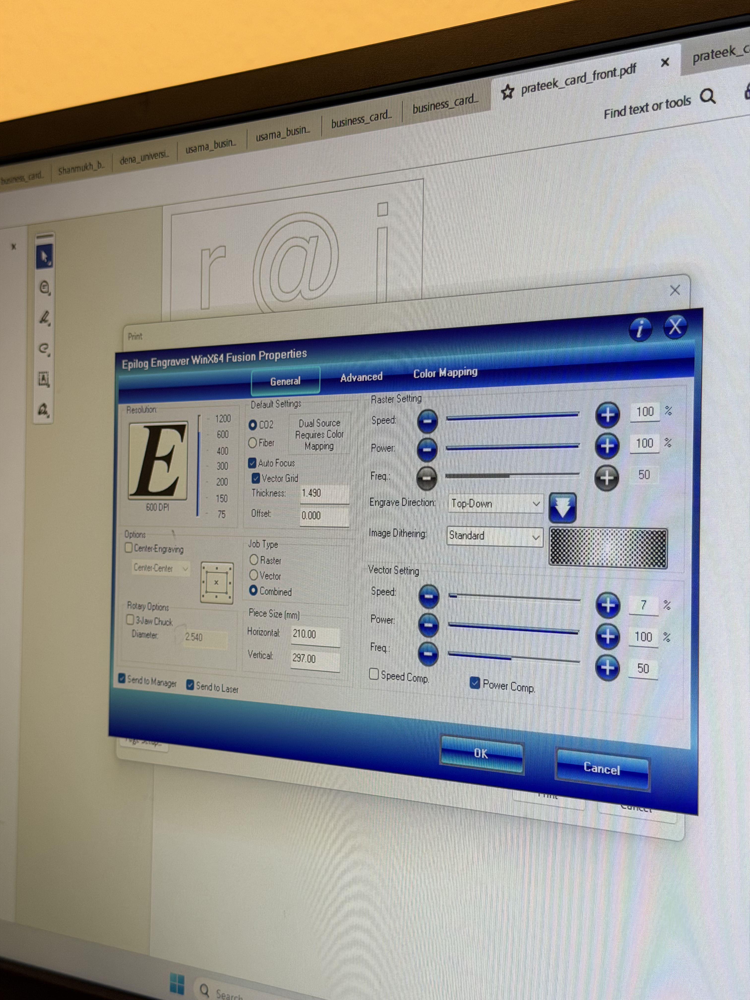
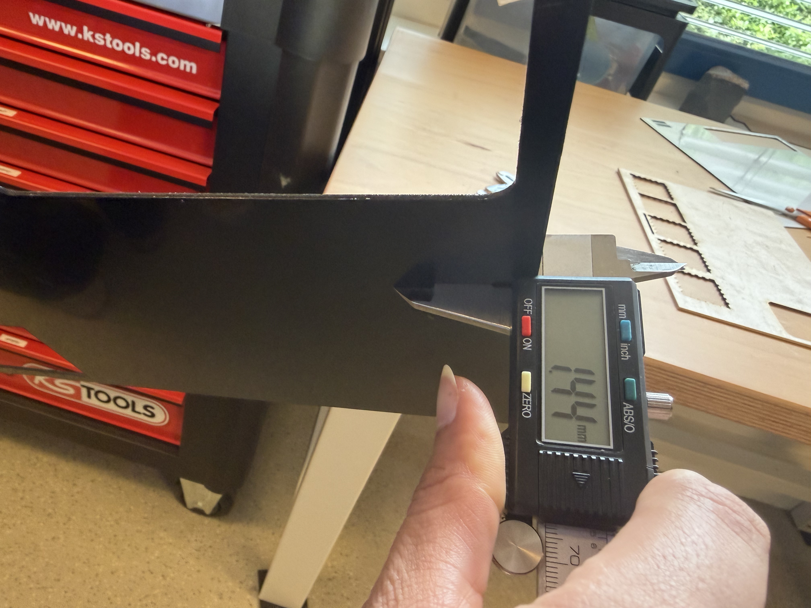
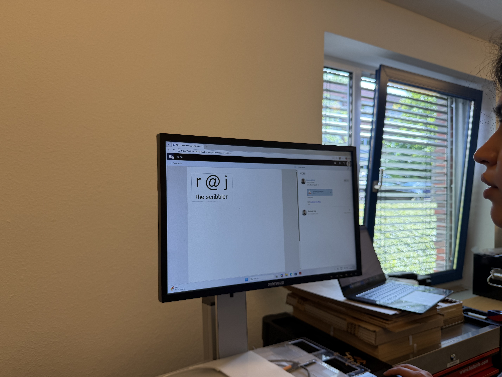
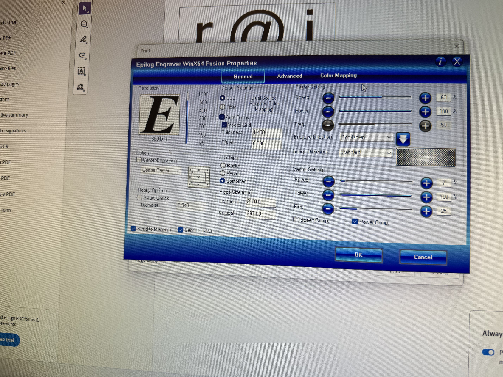
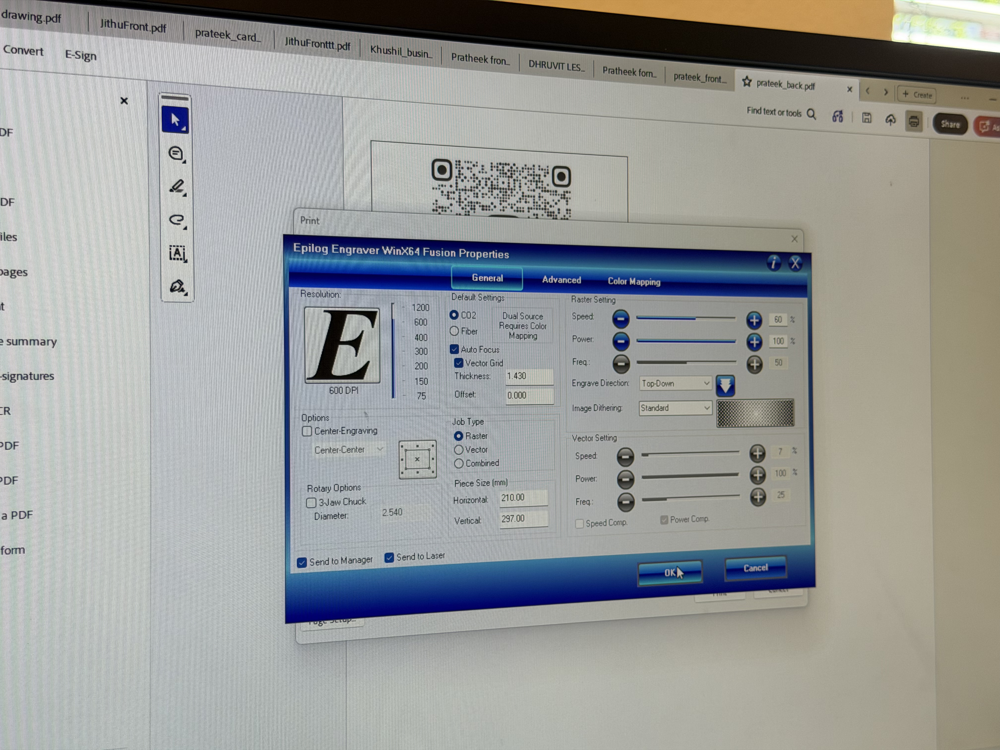

# Laser Cut Business Cards

In the exercise 6, the task was to create a laser-cut business card employing both raster and vector modes on the laser cutting machine.

I decided to create a business card dedicated to my alter ego "rajthescribbler" who writes his thoughts and feelings in the form of poetry. The idea was to print the instagram handle name on the front-side with "r @ j" in a large font followed by the catch-phrase "the scribbler" right below it - in a smaller font. For the back-side of the business card, I finalised to have the profile QR code printed, which upon scanning should redirect to my profile.

Although the task appeared quite simple and I already had the design finalised, it took me 2 failed attempts to finally print the design I imagined.

   

  

---

## Attempt 1:

In my first attempt, I selected a sheet of transparent acrylic, after being inspired by how good the raster looks in designs I researched online. 

I set the printer settings to perform both Raster and Vector at 7% Speed / 100% Power / 50 Frequency. Upon executing the print command, the laser head started to print the front-side of my design. 

  |  Material Thickness | Front Design | Printing Settings | 
  | :---: | :---: | :---: |
  |  |  |  |
  

Since for the first attempt, I chose a font with hollow outlines, the text looked amazing with sparkling edges over a transparent material. Whne the front-side finished printing, the machine stood still and did not continue to the outer vector path. I wasn't sure what the problem is - the tutor suggested to resend the print command but even after doing so, the vector operation did not resume.

  <video src= "https://github.com/user-attachments/assets/9a059c66-7202-451f-ae9d-fb0ae23bea59" controls autoplay muted loop style="max-width: 100%;"> </video> 

The tutor then suggested to power-cycle the Computer and the laser printer. But, before the machines booted and became available, another student removed my acrylic board and placed their own to run their print job. After they finished, I got the control of the machine back and placed my material for cutting. This time the vector command worked but it cut right through my design and hence led to the first failure.

Furthermore, after this accident, I also realised that I had erred in choosing of material - the transparent acrylic looked beautiful with the front-side printed but if the back-side with QR code had also been printed, both these designs would have superimposed making it look like a squiggle. 

  

---

## Attempt 2

For the second attempt, I did two things - first, I changed the text on the front-side to a bold font so it stands out after rastering; second, I converted QR code color profile to grayscale for better rastering output. This time I decided to go with a golden/black acrylic - golden on one side and black on the other.

  

  

This time while printing, I reduced the frequency to 25% considering the delicate golden layer of the material. 

  |  Material Thickness | Front Design | 
  | :---: | :---: |
  |  |  |
  

The rastering and vectoring worked perfectly, and the end-product was a shiny looking front-side of the business card.

  

 
As I removed the card from the laser printer bed for printing the back-side, the realisation dawned - except for the front the acrylic is entirely black; rastering a QR code on a black surface wouldn't result in enough contrast for a smartphone camera to detect it. This was my second failure.

---

## Attempt 3

This time, I decided to use plywood board since I had already tried plastics twice. Without any changes to the design or printing settings, I issued the print command. 

  |  Front Print Settings | Back Print Settings | 
  | :---: | :---: |
  |  |  |
  

As expected, the rastering and vectoring for the front-side completed perfectly. I took out the cutout, reversed it and placed it in the same slot for back-side printing, and the perfect QR code raster started to emerge.

  <video src= "https://github.com/user-attachments/assets/3d0c092d-5c7a-4b74-803b-98e76abc69b9" controls autoplay muted loop style="max-width: 100%;"> </video> 

  <video src= "https://github.com/user-attachments/assets/f273f47e-4835-4d2d-a76c-6e0b8cf2d627" controls autoplay muted loop style="max-width: 100%;"> </video> 

  <video src= "https://github.com/user-attachments/assets/973458c3-f009-41e9-a737-563256270652" controls autoplay muted loop style="max-width: 100%;"> </video> 

  <video src= "https://github.com/user-attachments/assets/94672754-e354-4e97-bd9e-84fb5290df1b" controls autoplay muted loop style="max-width: 100%;"> </video> 

I finally succeeded in printing a business card at the third attempt. Upon observing closely, I saw some charring marks around the edges, which couldn've been avoided using a paper tape before starting to print.

  |  Front | Back | 
  | :---: | :---: |
  |  |  |
  

---

 

[← Back to Table of Contents](../README.md)
